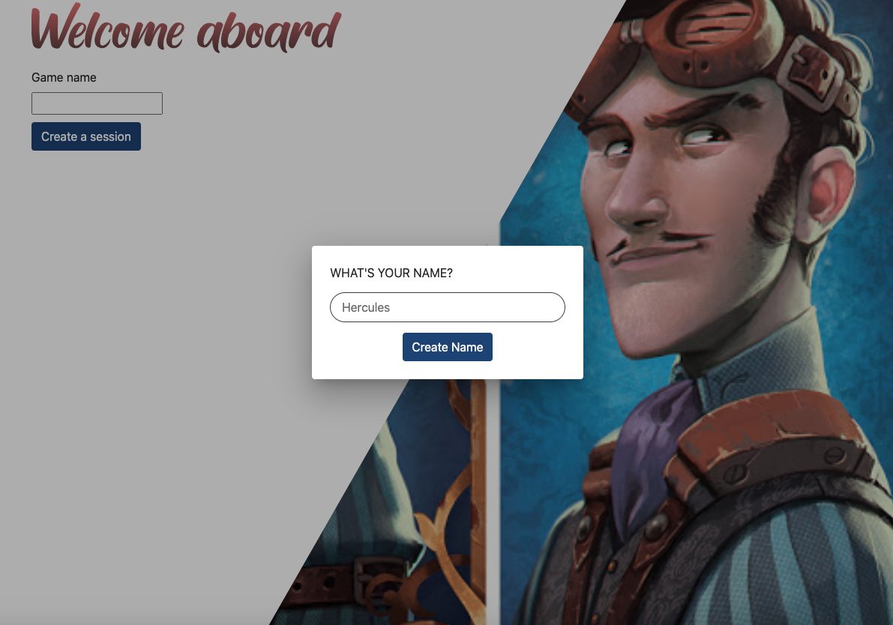
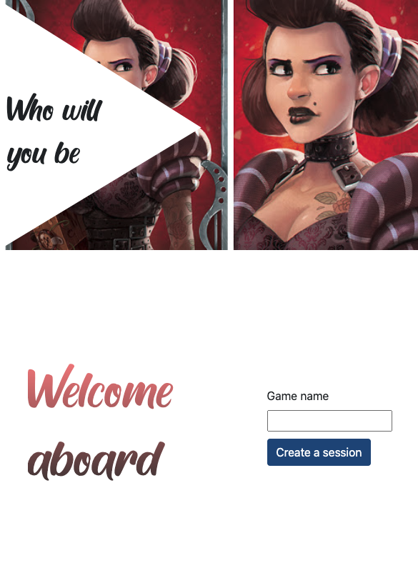

# Realtime chatroom

I'm using my Node.js [Websocket API](https://github.com/aminetchitooss/node_socket) 

Desk View                  |  Phone View
:-------------------------:|:-------------------------:
       |  


## How to use

  Make sure to set up a "environement file" config file to store variables like 
    
```javascript

export const environment = {
  production: false ,// true for prod
  uri: 'http://localhost:5000', // The deployment link For production
  userKey: "currentUser", // Simple word (dealer's choice)
  masterKey: "XXX", // Importnant --> same key for backend APi
};

```

### Dev

Run `ng serve` for a dev server. Navigate to `http://localhost:4200/`


###n `ng build` to build the project. The build artifacts will be stored in the `dist/` directory. Use the `--prod` flag for a production build.
